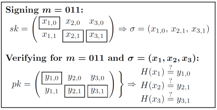

# general-ots
Hash based signatures based upon Lamport OTS, but you can keep signing (implemented in python)


## Download

All the code is just in a single ~420 line file. Simply download the file like this:

`wget https://raw.githubusercontent.com/tintin10q/general-ots/main/general_ots.py`

or

`curl https://raw.githubusercontent.com/tintin10q/general-ots/main/general_ots.py > general_ots.py`

## Usage:

```python
from general_ots import GeneralOTS

print("\n\nAlice signs 3 messages with secret key:")

OTS = GeneralOTS() # This auto generates a key, you could also use general_ots.genkey()
pk = OTS.pk 

signature = OTS.sign(b"tintin10q")
print(OTS.verify(signature, pk))

print(OTS.verify(OTS.sign(b"is"), pk))
print(OTS.verify(OTS.sign(b"Cool"), pk))

#  Export the signature
with open('sig.json', 'w+') as outfile:
    OTS.last_signature.save(outfile)

with open('key.json', 'w+') as keyfile:
    OTS.initial_keys.save_pk(keyfile)

#  Someone else imports the signature and our public key
from general_ots import SignatureChain, OTSkey
OTSBob = GeneralOTS(debug=True)  # Someone's else who has our initial pk

print("\n\nBob imports signature and public key:")
with open('sig.json', 'r') as sigfile:
    signature_Alice = SignatureChain.load(sigfile)

with open('key.json', 'r') as keyfile:
    imported_pk = OTSkey.load_pk(keyfile)

print(OTSBob.verify(signature_Alice, imported_pk))

# size of 12th signatures (with empty messages)
print("\nSize of 12th signature:")
for i in range(12):
    print(f"SignatureChain: {i + 1} = {len(OTSBob.sign(b'').to_bytes())} bytes")
```

You can also export as `.toml` files (which looks way better) but then you need to install the toml dependency using:
`pip install toml`. 

## The General OTS protocol: 

[Sha3-256](https://en.wikipedia.org/wiki/SHA-3) is used as both H0 and H1.

### Key Generation:

1. Generate a pair of secret and public key $(sk_1, pk1)$ using [Lamport's OTS keygen](https://en.wikipedia.org/wiki/Lamport_signature) for 256-bit messages using SHA3-256 as the internal hash function $H_0$;
2. Set a state to S = () and σ0 = ().

### Signing: 

To sign messages $M_1, i = 1, 2, ...$ the signer operates as follows:

1. Generate a new key pair $(sk_{i+1}, pk_{i+1});$
2. Compute $s_{i,OTS} = Sign_sk_{i}, (H1(M_i, pk_i+1))$ where $Sign_{sk_i}$, is the signing algorithm of
[Lamport's OTS](https://en.wikipedia.org/wiki/Lamport_signature) using the secret key $sk_i$, and $H1$ some hash function;
3. Construct the signature $σ = (M_i, pk_{i+1}, S_{i,OTS}, σ_{i-1})$;
4. Add $(M_i, pk_{i-1}, sk_{i+1}, S_{i,OTS})$ to the state S.

###  Verification: 

To verify the signature $σ_i = (M_i, pk_{i+1}, S_{i,OTS}, σ_{i-1})$:

- Check $Vf_{pk_j}(M_j, pk_{j+1},S_j,OTS) = 1$ for all $j \in \textbraceleft 1, 2,...,i \textbraceright$


## Lamport OTS Protocol 

The [Lamport OTS](https://en.wikipedia.org/wiki/Lamport_signature) signature is defined like this:

### Key Generation:
On input of $\{0,1\}^n$, proceed as follows for $i \in \textbraceleft 1,l\textbraceright$:
1. Choose uniform $x_{i,0},x_{i,1} \in \textbraceleft 0,1\textbraceright^n$ 
2. Compute $y_{i,0} := H(X_{i,0})$ and $y_{i,1} := H(X_{i,1})$

The public and private keys are 

```
secret key = [ y_{1,0},  y_{2, 0}, y_{3, 0}, ..., y_{l,0} ]
             [ y_{1, 1}, y_{2, 1}, y_{3, 1}, ..., y_{l,1} ]

with every y_{i, j} = H(x_{i,j}) you get:

public key = [ y_{1,0},  y_{2, 0}, y_{3, 0}, ..., y_{l,0} ] = [ H(x_{1,0}),  H(x_{2, 0}), H(x_{3, 0}), ..., H(x_{l,0}) ]
             [ y_{1, 1}, y_{2, 1}, y_{3, 1}, ..., y_{l,1} ]   [ H(x_{1,0}),  H(x_{2, 0}), H(x_{3, 0}), ..., H(x_{l,0}) ]
```

### Signing: 
On input of a private key $sk$ as above and a message $m \in \textbraceleft 0,1\textbraceright^l$ 
with $m = m_1...m_l$, output the signature $(x_{1,m_1}, x_{l,m_l})$.


###  Verification: 

On input of a public key $pk$ as above and a message $m \in \textbraceleft 1,0\textbraceright^l$
with $m = m_1...m_l$, and a signature $σ = (x_1,...x_l)$ output 1 if and only if $H(x_i) = y_{i,m_i}$ for all 1 $\geq i \geq l$.

### Example:



